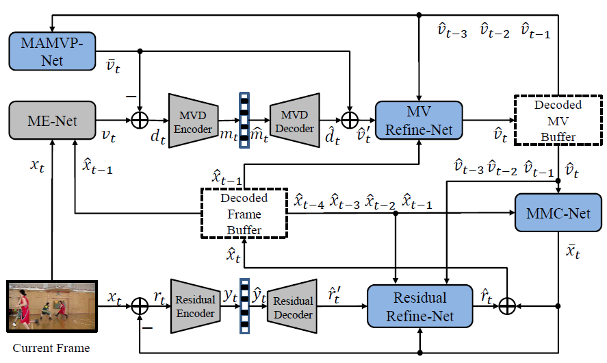

# M-LVC: Multiple Frames Prediction for Learned Video Compression

The project page for the paper:

Jianping Lin, Dong Liu, Houqiang Li, Feng Wu, “M-LVC: Multiple Frames Prediction for Learned Video Compression”. in IEEE/CVF Conference on Computer Vision and Pattern Recognition (CVPR), 2020. [[OpenAccess](https://openaccess.thecvf.com/content_CVPR_2020/html/Lin_M-LVC_Multiple_Frames_Prediction_for_Learned_Video_Compression_CVPR_2020_paper.html)][[arXiv](https://arxiv.org/abs/2004.10290)]

If our paper and codes are useful for your research, please cite:
```
@inproceedings{lin2020m,
  title={M-LVC: Multiple Frames Prediction for Learned Video Compression},
  author={Lin, Jianping and Liu, Dong and Li, Houqiang and Wu, Feng},
  booktitle={Proceedings of the IEEE/CVF Conference on Computer Vision and Pattern Recognition},
  pages={3546--3554},
  year={2020}
}
```
If you have any question or find any bug, please feel free to contact:

Jianping Lin @ University of Science and Technology of China (USTC)

Email: ljp105@mail.ustc.edu.cn

## Introduction



We propose an end-to-end learned video compression scheme for low-latency scenarios. Previous methods are limited in using the previous one frame as reference. Our method introduces the usage of the previous multiple frames as references. In our scheme, the motion vector (MV) field is calculated between the current frame and the previous one. With multiple reference frames and associated multiple MV fields, our designed network can generate more accurate prediction of the current frame, yielding less residual. Multiple reference frames also help generate MV prediction, which reduces the coding cost of MV field. We use two deep auto-encoders to compress the residual and the MV, respectively. To compensate for the compression error of the auto-encoders, we further design a MV refinement network and a residual refinement network, taking use of the multiple reference frames as well. All the modules in our scheme are jointly optimized through a single rate-distortion loss function. We use a step-by-step training strategy to optimize the entire scheme. Experimental results show that the proposed method outperforms the existing learned video compression methods for low-latency mode. Our method also performs better than H.265 in both PSNR and MS-SSIM. Our code and models are publicly available.

## Codes
The currently available code is for evaluation, while it can also be modified for training as the implementation of the network is available.

### Dependency
- tensorflow-gpu >=1.13.1 (the code only can be run in GPU mode)

- opencv-python, matplotlib, scipy, pillow

- Pre-trained models ([Download link]())

- BPG ([Download link](https://bellard.org/bpg/))

(*In our code, we use BPG to compress I-frames instead of training learned image compression models. Here, we upload the executable files of BPG for windows.*)

### Compressing video sequences

We feed the video sequences in YUV420 format into the encoder. Since our code currently only supports the sequences with the height and width as the multiples of 64, we first use ffmpeg to resize the original sequences to the multiples of 64, e.g.,
```
ffmpeg -pix_fmt yuv420p -s 1920x1080 -i input_video.yuv -vf scale="1920:1024" output_video.yuv
```
The resized sequences of UVG and HEVC datasets can be downloaded from ([link]()).

You can use the following command to compress any class of the UVG and HEVC datasets:

```
python test.py --command compress --test_seq_dir directory_containing_testSequence --test_class ClassC --exp_data_dir ./exp_data_dir -r path_to_model/model_name.ckpt --lambda 16
```
```
--test_class, the video class to be compressed (e.g., ClassB, ClassC, ClassD, ClassE, ClassUVG)
--lambda, the lambda value of used trained model (i.e., 16, 24, 40, 64)
```

### Entropy coding
Currently, we do not provide the entropy coding module. We give the estimated Bpp for these features. It is straightforward to compress these features by using traditional entropy coding tools, such as Range Coder.

### Experimental Results

# Contact
Email: ljp105@mail.ustc.edu.cn
